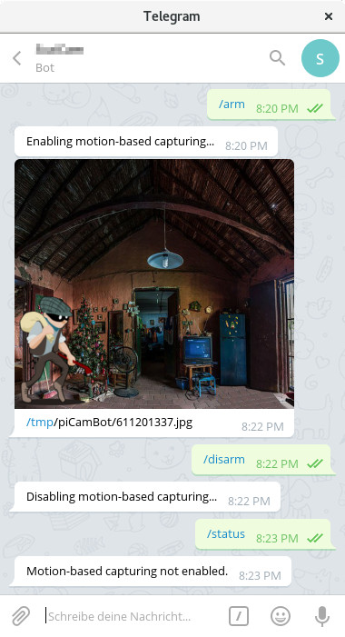
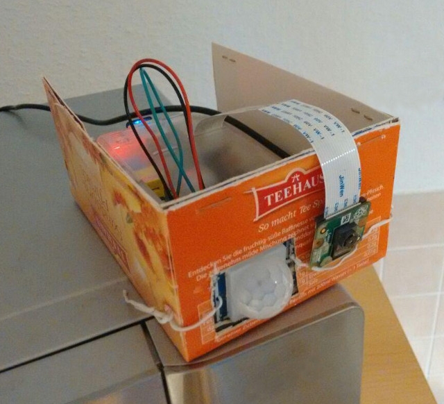

# piCamBot
Security camera based on a Raspberry Pi and Telegram, controllable via smartphone and computer.

## Description
This is a simple Telegram bot that acts as a security camera. It is intented to run on a Raspberry Pi but may be used on any other Linux system, too. It requires a camera (for example a Raspberry Pi Camera Module v2) and either a PIR sensor or the software *motion*. It can be controlled by any Telegram client, thus supporting many different client platforms such as smartphones (Android, iOS and Windows Phone) and computers (Linux, macOS and Windows).

## Requirements
- Raspberry Pi with [Raspberry Pi OS](https://www.raspberrypi.org/software/) (recommended, but works on any other Linux system with some adjustments)
- Camera (e.g. Raspberry Pi Camera Module v2)
- PIR sensor (e.g. HC-SR501) or [motion](https://motion-project.github.io/) software (using the PIR sensor is recommended, it works way better than using motion software)
- Piezo buzzer (optional)
- [Telegram](https://telegram.org/) account and a [Telegram bot](https://core.telegram.org/bots)
- python (version 3):
  - [RPi.GPIO](https://sourceforge.net/projects/raspberry-gpio-python/) (optional, for controlling a PIR sensor, a buzzer or LEDs)
  - [python-telegram-bot](https://github.com/python-telegram-bot/python-telegram-bot)
  - [PyInotify](https://github.com/dsoprea/PyInotify)

To install the necessary software on Raspberry Pi OS, Debian or a similar distribution use the following commands:
- as root:
  - `apt install python3-rpi.gpio` (optional, for PIR or buzzer support)
  - `apt install python3-pip`
- as regular user:
  - `pip3 install python-telegram-bot==13.14 inotify`
  
## Configuration
Copy `config.json.example` to `config.json` and open it for editing. In section `telegram` enter your Telegram `token` and `owner_ids`. See these [instructions for obtaining your Telegram user ID](https://stackoverflow.com/questions/31078710/how-to-obtain-telegram-chat-id-for-a-specific-user). Alternatively just add your Telegram token and a random owner ID, run piCamBot and send a message to your bot. piCamBot will log messages from unknown users and write out their user IDs.

If you aren't using a Raspberry Pi then you need to change `pir`:`capture_cmd` and `capture`:`cmd` to use a different command than `raspistill`.

Either enable `pir` (when using a PIR sensor) or `motion` (when no PIR sensor is available). It is highly recommended to use a PIR sensor since it works better than motion in my experience.

Note: You can't enable `pir` and `motion` at the same time. However you can disable both and still use piCamBot to perform manual camera captures.

### 1a) Configuration using a PIR sensor
Set a correct `pir`:`gpio` port. You can use `python3 test_pir.py` to check if the PIR is working and a correct gpio port has been configured.

### 1b) Configuration using motion software
Note: It is highly recommended to use a PIR sensor instead. The code for using motion instead is not really maintained. Also, in most cases a PIR sensor works way better than motion.

Check that the `pid_file` path is correct. It must match the `process_id_file` setting in your `motion.conf`. Also check that `general`:`image_dir` matches your `motion.conf`'s `target_dir`. Edit `motion.conf` and adjust `rotate`, `width`, `height` to your camera. Also adjust `threshold` and `noise_level` to your environment (good luck with that...). `daemon` mode must be enabled for piCamBot!

Ideally run motion separately to adjust all these settings until it matches your expected results. Afterwards try to use it with piCamBot.

### 2) Configuring a buzzer

You can enable acoustic alarms, e.g. with a piezo buzzer. Enable the buzzer via `buzzer`:`enable` and set `buzzer`:`gpio` accordingly. You can also define custom buzzer sequences for various actions. To see if the buzzer is working and the correct gpio port has been set you can run `python3 test_buzzer.py` or send the `/buzzer` command.

### Optional: Use a tmpfs for captured images
Especially when using a Raspberry Pi it is a good idea to write captured images to a tmpfs. This increases the lifespan if your sdcard. Using the standard configuration piCamBot writes its captures to `/tmp/piCamBot/`. To mount `/tmp/` as tmpfs add the following line to your `/etc/fstab`:
```
tmpfs           /tmp            tmpfs   nosuid,size=25%   0       0
```
After a reboot `/tmp/` should be mounted as tmpfs.

### 3) Using LED(s) during capture

To improve image quality during low light you can turn on LED(s) during image capture.  Enable `capture`:`led`:`enable` and set `capture`:`led`:`gpio` accordingly.

LEDs can also be turned on and off explicitly by using the command `/ledtoggle`.

## Starting the bot
Execute `python3 piCamBot.py` as a regular user, i.e. non-root. The bot will automatically send a greeting message to all owners if Telegram access is working. For troubleshooting take a look at its log files inside the piCamBot directory.

### Autostart
It is recommended to start the bot automatically after boot, e.g. via a crontab entry or init script. Here is an example for starting the bot automatically at boot inside a tmux session, via cron (`crontab -e` as a regular user, i.e. non-root):
```
@reboot              cd ~/picambot && SHELL=/bin/bash tmux new -d -s picambot "python3 piCamBot.py"
```
You can attach to it via `tmux a -t picambot` and detach from it via the default key binding `ctrl-b d`.

There is also a shell script which automatically restarts the bot on fatal errors: `piCamBotLoop.sh`. To use it, just run this shell script instead of the python script. You can also add it to cron, of course (as an alternative to the previous example, don't add both!):
```
@reboot              cd ~/picambot && SHELL=/bin/bash tmux new -d -s picambot "./piCamBotLoop.sh"
```

## Controlling the bot
The bot will start with motion-based capturing being disabled.

After enabing motion-based capturing it will either react on the PIR sensor and performs captures whenever a motion is reported. Or it reacts on captures performed by the motion software. In either case, captured images are sent via Telegram to all owners. Afterwards these images are deleted from the disk. You can control this behavior via config option `general`:`delete_images`.

You can use `/help` to list the available commands:
- `/arm`: Starts motion-based capturing. If `motion` software is enabled it will be started as well.
- `/disarm`: Stops motion-based capturing. If `motion` software is enabled it will be stopped as well.
- `/status`: Reports whether motion-based capturing is currently enabled.
- `/capture`: Takes a manual capture with the camera. If motion-based capturing and `motion` software is enabled it will be temporarily stopped and started again after the capture. This is needed since access to the camera is exclusive.
- `/kill`: Only to be used if motion software is enabled. This kills the software (using SIGKILL) in case it is running and `/disarm` fails to stop it.
- `/ledtoggle`: Toggle capture LED, if configured.
- `/ledstatus`: Show state of capture LED (on/off), if configured.
- `/buzzer`: Trigger buzzer, if configured.
- `/log`: Show recent log messages.
- `/help`: Shows a list of supported commands.

# Examples

## Example conversation with the Telegram bot


## Example Raspberry Pi based security cam with PIR sensor


# License
[GPL v3](http://www.gnu.org/licenses/gpl.html)
(c) [Alexander Heinlein](http://choerbaert.org)
